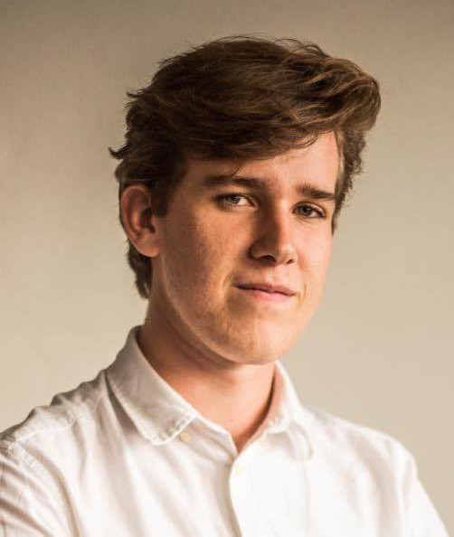
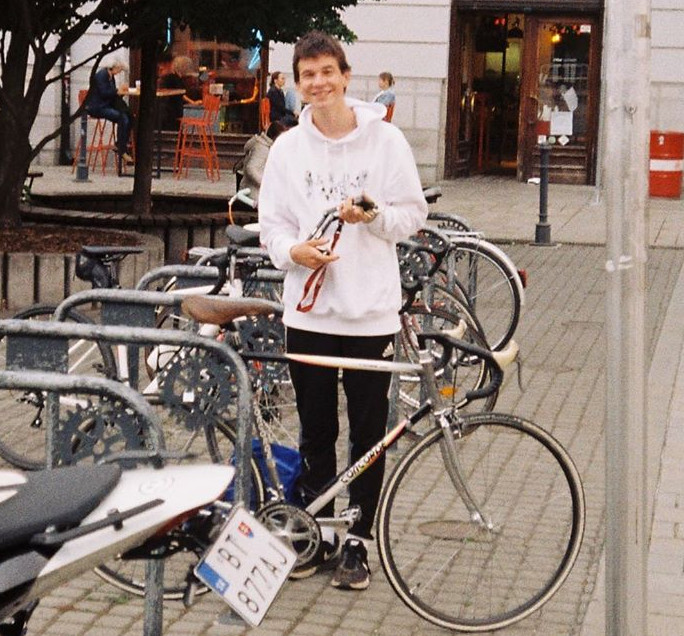
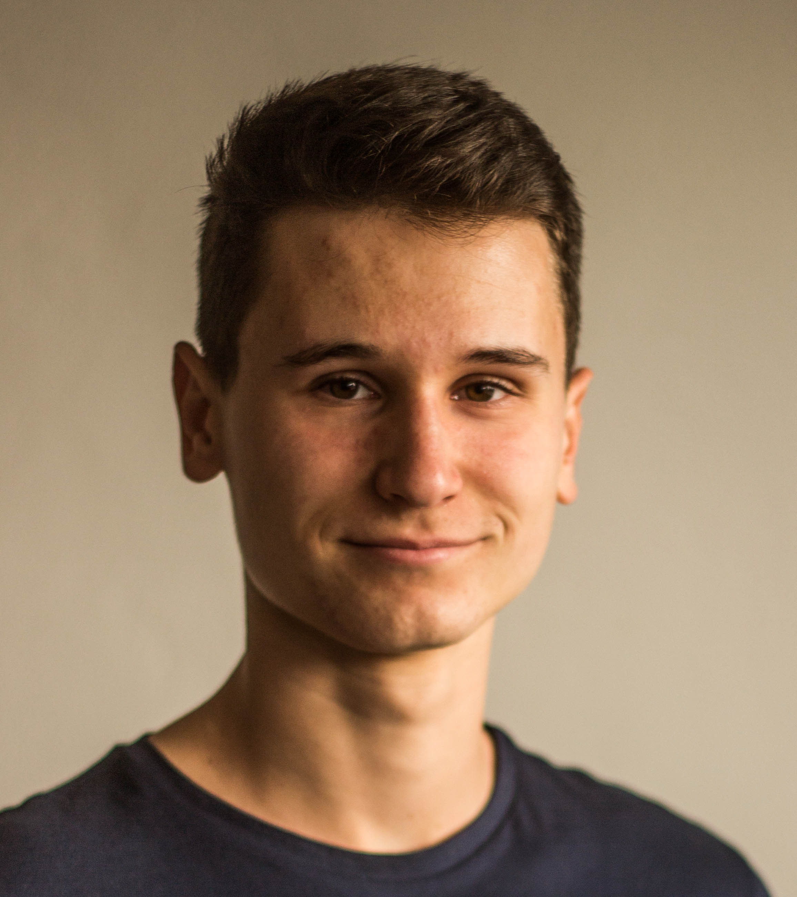

# Absolventi 1. ročník: 2019/2020

## Richard Hamerlík

```{margin} 

```

Pre mňa osobne akadémia vyniká najmä dvomi vecami - učebné materiály a komunita. Materiály sú originálne a sú založené na reálnych problémoch. Často sa mi stávalo, že keď som na akadémií nestihol dokončiť nejakú úlohu tak som sa ponáhľal domov pokračovať, aby som prišiel s odpoveďou, ktorá ma uspokojila. Ako som však spomínal nie sú to iba materiály, čo mi akadémia dala, sú to aj nesmierne šikovní a obohacujúci ľudia, s ktorými som spoločne riešil problémy a navzájom sme sa posúvali ďalej. Absolvovanie brutálnej akadémie (pilotný názov) bola jedna z vecí, ktoré ma nielen v akademickom ale aj osobnom živote najviac posunuli a odporúčal by som každému, aby si niečo také zažil.

## Kristián Čabala

```{margin} 

```

Čaute, volám sa Kiko a tento rok som sa zapojil do pilotnej verzie Akadémie. Hneď zo začiatku ma upútalo to, že síce sa budeme venovať matematike/informatike - veciam podobným a akademickým - no nie priamo takým spôsobom, s akým sme sa mohli stretnúť na olympiádach či seminároch. Tie ma osobne až tak nenapĺňali. Musím povedať, že sľuby boli dodržané a počas celého “semestra” sme sa venovali veľmi praktickým a zaujímavým veciam - hlavne teda herným stratégiam a modelom za nimi. Bolo strašne fajn, že na riešenie problémov sa vždy používala matematika, programovanie alebo ich kombinácia.

Neoddeliteľnou súčasťou pre mňa bola však aj komunita, resp. kamaráti, s ktorými som sa mohol každý týždeň vidieť. Atmosféra na “hodinách” bola vždy strašne fajn, veľmi uvoľnená a priateľská. Snáď každú stredu sme zostali ešte po lekciách spolu a hrávali kalčeto v budove školy a veľmi som si to užíval. 


## Alex Chudíc

```{margin} 

```

Akadémia bola pre mňa skvelá skúsenosť, naučila ma množstvo nového a ukázala mi, že vysokoškolská matika nie je iba o dokazovaní nechutných vzorcov. Pracovanie v tomto prostredí bolo príjemné a vďaka práci v skupinkách sme boli častokrát schopní vypočítať príklady, na ktoré by sme sami neprišli. Najviac sa mi ale páčilo, že sme boli nútení myslieť "outside the box", na rozdiel od toho čo nás učia v škole.